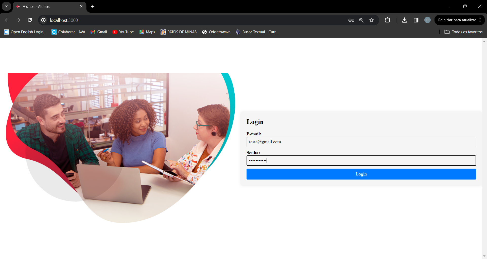
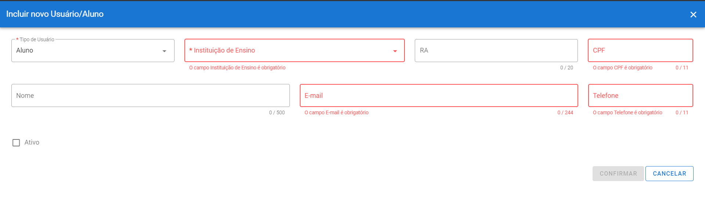
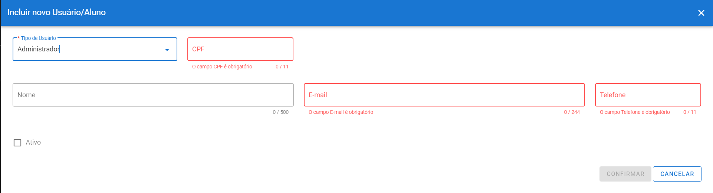
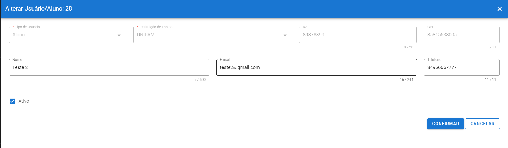
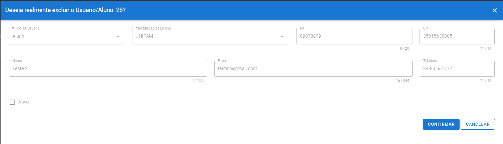
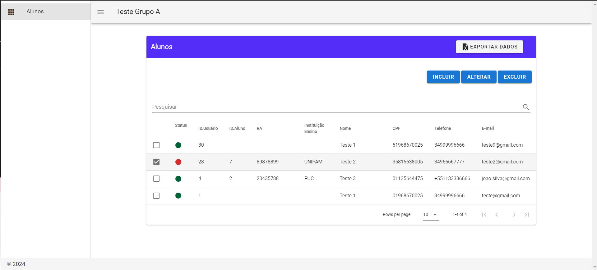

# Instruções para Iniciar os Projetos

## Dependências
Para iniciar os projetos, é necessário instalar as dependências. Certifique-se de ter o Node.js e o npm instalados em seu ambiente de desenvolvimento. Você pode instalar as dependências executando o seguinte comando no terminal:

## Arquivos .env
Os arquivos `.env` foram incluídos no repositório para facilitar a execução do projeto, embora não seja uma prática recomendada. Certifique-se de revisar e ajustar os valores no arquivo `.env` conforme necessário para o seu ambiente de desenvolvimento.

## Backup do Banco de Dados
Um backup do banco de dados também foi incluído no repositório para facilitar a execução do projeto. Certifique-se de restaurar o backup do banco de dados antes de iniciar o projeto, se necessário.

## Autenticação

Para fins de autenticação, você pode usar as seguintes credenciais:
- **Usuário:** teste@gmail.com
- **Senha:** 01968670025

Abaixo algumas telas para familiarização. 

## Incluir 

## Alterar 

## Excluir

## Visualizar

